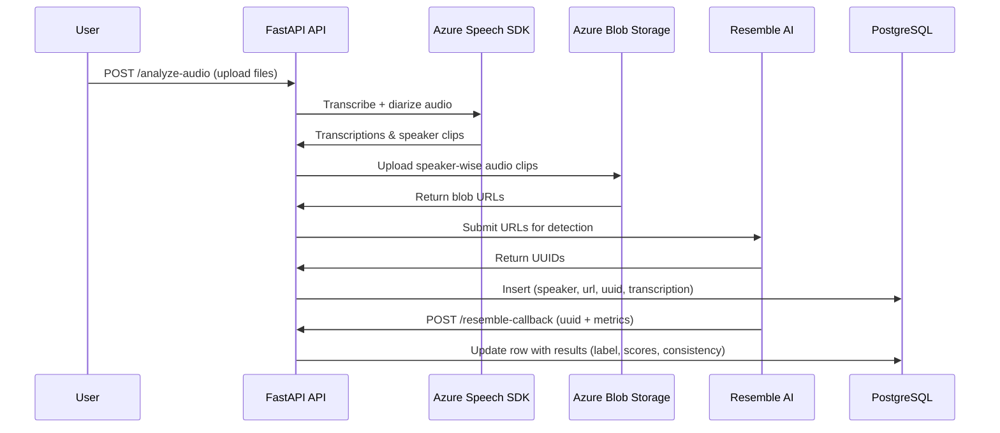

# AudioAI-Detective-API
# 🎙️ Synthetic Voice Detection Pipeline

This project is an **end-to-end pipeline** for detecting synthetic/AI-generated voices from uploaded audio files.
It integrates **Azure Cognitive Services** (transcription & speaker diarization), **Azure Blob Storage** (speaker-wise clip storage), and **Resemble AI** (synthetic voice detection), with results stored and updated in a **PostgreSQL database**.

---

## 🚀 Features

* Upload multiple audio files via FastAPI
* Non-blocking **background task processing**
* **Speaker diarization & transcription** using Azure Speech SDK
* **Automatic clip upload** to Azure Blob Storage
* **Resemble AI deepfake detection** with async callbacks
* **Database storage & updates** for full traceability

---

## 🔄 Processing Workflow



---

## 📡 API Endpoints

### 🔹 `POST /analyze-audio`

Upload and process one or more audio files.

**Headers:**

```http
Authorization: Basic <username:password>
```

**Example Request:**

```bash
curl -u admin:secret123 -X POST http://localhost:8000/analyze-audio \
  -F "files=@sample1.mp3" \
  -F "files=@sample2.m4a"
```

**Response:**

```json
{
  "message": "Processing started for 2 file(s).",
  "files": ["tmpabc123.mp3", "tmpxyz456.m4a"]
}
```

---

### 🔹 `POST /resemble-callback`

Receives analysis results from Resemble AI.

**Payload Example (from Resemble):**

```json
{
  "item": {
    "uuid": "6d8a2b4f-1234-4c3a-a3bb-5e97af9f0e9c",
    "metrics": {
      "label": "synthetic",
      "score": [0.92, 0.87, 0.89],
      "consistency": 0.91,
      "aggregated_score": 0.90
    }
  }
}
```

**Response:**

```json
{"message": "Callback received, processing started in background"}
```

---

## 🗄️ Database Schema

```sql
CREATE TABLE audio_data (
    id SERIAL PRIMARY KEY,
    speaker_name VARCHAR(50) NOT NULL,
    file_url TEXT NOT NULL,
    file_uuid UUID NOT NULL,
    transcriptions JSONB NOT NULL,
    analysis_label VARCHAR(50),
    analysis_scores JSONB,
    consistency NUMERIC,
    aggregated_score NUMERIC
);
```

---

## 🔧 Setup & Installation

### 1. Clone the repository

```bash
git clone https://github.com/your-org/synthetic-voice-detection.git
cd synthetic-voice-detection
```

### 2. Create a virtual environment

```bash
python -m venv venv
source venv/bin/activate  # Linux/Mac
venv\Scripts\activate     # Windows
```

### 3. Install dependencies

```bash
pip install -r requirements.txt
```

### 4. Configure Environment Variables

Create a `.env` file:

```ini
# Azure Speech Service
SPEECH_KEY=your_speech_key
SPEECH_REGION=your_region

# Azure Blob Storage
AZURE_STORAGE_CONNECTION_STRING=your_blob_connection_string

# Resemble AI
RESEMBLE_API_TOKEN=your_resemble_api_token

# Database
DB_HOST=localhost
DB_PORT=5432
DB_NAME=synthetic_voice
DB_USER=youruser
DB_PASS=yourpassword
```

### 5. Run the API server

```bash
uvicorn main:app --reload
```

---

## 🛠️ Tech Stack

* **FastAPI** – API framework
* **Azure Cognitive Services (Speech SDK)** – Transcription & diarization
* **Azure Blob Storage** – Speaker clip storage
* **Resemble AI** – Synthetic voice detection
* **PostgreSQL** – Result storage
* **pydub** – Audio preprocessing

---

## 📌 Notes

* Processing runs in **background tasks** → avoids blocking requests.
* Only **MP3, M4A, WAV** formats supported.
* **Asynchronous detection** → Resemble AI results only available after callback.
* Authentication = **HTTP Basic** (replace with OAuth/JWT for production).

---

## ✅ Future Enhancements

* Add support for more formats/codecs
* Real-time streaming analysis
* Monitoring/logging with ELK/Prometheus
* Dashboard UI for visualization
* Dockerized deployment

---

Would you like me to also **include sample DB entries (before & after callback)** in the README, so new contributors immediately understand how the table evolves across processing?
